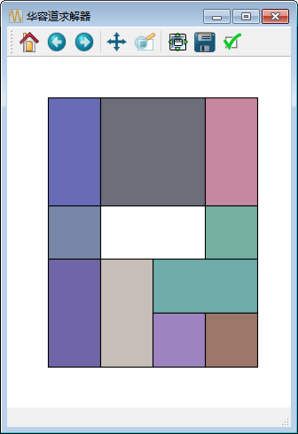
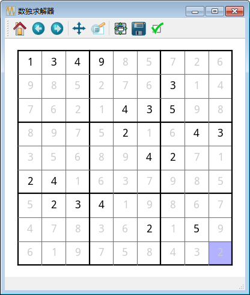
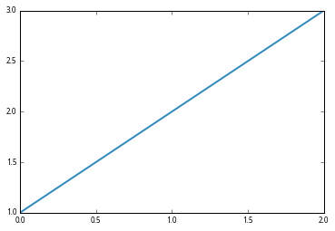

# Scpy2 - Python科学计算第二版实例代码集

`scpy2`为Python科学计算第二版的实例代码集，其中的包含许多演示代码以及一些实用的模块。

## Scipy

### 解华容道

演示如何使用`scipy.sparse.csgraph`解华容道谜题。4种方块分别使用ABCD四个符号表示，空格表示无方块，例如标准开局为：

    BAAB
    BAAB
    BCCB
    BDDB
    D  D

使用字符串`BAABBAABBCCBBDDBD  D`表示。

这种布局一共有1个A、4个B、1个C和4个D方块，首先运行如下程序产生这些方块的所有布局：

    !python -m scpy2.scipy.hrd ABBBBCDDDD

然后运行如下命令对横刀立马布局`BAABBAABBCCBBDDBD D`求解，该程序使用matplotlib制作界面。按箭头演示解题步骤，按空格键播放/暂停。

    !python -m scpy2.scipy.hrd_solver "BAABBAABBCCBBDDBD  D"

## matplotlib

[matplotlib相关演示程序的文档](matplotlib.md)

## Cython

### 多关键字搜索

`scpy2.cython.multisearch.MultiSearch`演示如何对C语言的库进行包装。这里使用的库为[multifast](http://s
ourceforge.net/projects/multifast/)。它能对文本使用多个关键词进行搜索。

    from scpy2.cython import MultiSearch
    
    ms = MultiSearch(["abc", "xyz"])
    print ms.isin("123abcdef")
    print ms.isin("123uvwxyz")
    print ms.isin("123456789")
    
    for pos, pattern in ms.iter_search("123abcdefxyz123"):
        print pos, pattern

    True
    True
    False
    3 abc
    9 xyz
    

## 实例篇

### cycosat

用Cython包装C语言的SAT问题求解器PicoSAT，并使用该扩展模块解决数独游戏和扫雷游戏。

 > http://fmv.jku.at/picosat/

例如如下问题：

有四位嫌疑犯，他们做了如下供述：

* 甲：不是我作案的。
* 乙：丁就是罪犯。
* 丙：乙是罪犯。
* 丁：乙有意诬陷我。

已知四个人当中只有一个说了真话。请推理出罪犯是谁？

    from scpy2.cycosat import CoSAT
    
    sat = CoSAT()
    problem = [[1, -4], [1, -2], [1, 4], [-4, -2],
               [-4, 4], [-2, 4], [-1, 4, 2, -4]]
    
    sat.add_clauses(problem)
    print sat.solve()

    [1, -1, -1, -1]
    

用`CoSAT`解数独游戏，按方向键移动光标，按数字键指定当前光标所在方格中的数字，0表示删除。黑色数字表示用户指定的数字，灰色数字为求解器的解。

    %exec_python -m scpy2.examples.sudoku_solver

## 写作工具

### 生成结构图

`GraphvizDataFrame, GraphvizMatplotlib, GraphvizMPLTransform`三个类用于生成对象结构图：

    %matplotlib inline
    import pylab as pl
    fig, ax = pl.subplots()
    ax.plot([1, 2, 3])
    
    from scpy2 import GraphvizMatplotlib
    dot = GraphvizMatplotlib.graphviz(fig)
    %dot -f png dot

