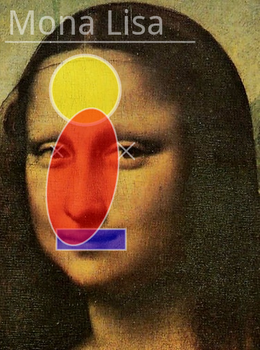
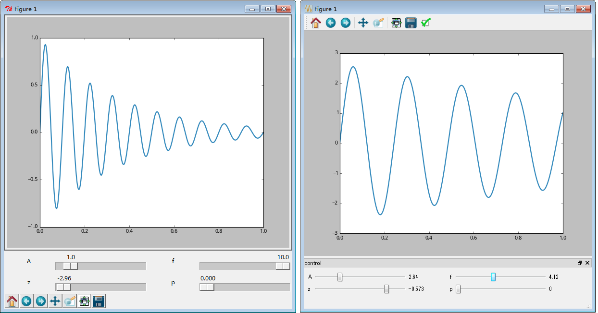

## matplotlib

### 事件

显示键盘按键

    %exec_python -m scpy2.matplotlib.key_event_show_key

键盘修改曲线颜色，输入`rgbcmyk`改变颜色

    %exec_python -m scpy2.matplotlib.key_event_change_color

显示鼠标事件

    %exec_python -m scpy2.matplotlib.mouse_event_show_info

鼠标移动多边形

    %exec_python -m scpy2.matplotlib.mouse_event_move_polygon

鼠标移动高亮显示曲线

    %exec_python -m scpy2.matplotlib.mouse_event_highlight_curve

选取事件

    %exec_python -m scpy2.matplotlib.pick_event_demo

### 高级技巧

本书提供的`scpy2.matplotlib.ImageDrawer`可以使用matplotlib的绘图函数直接在图像上绘图，对图像进行标注：

    from scpy2.matplotlib import ImageDrawer
    from matplotlib.pyplot import imread
    import numpy as np
    img = imread("vinci_target.png")
    drawer = ImageDrawer(img)
    drawer.set_parameters(lw=2, color="white", alpha=0.5)
    drawer.line(8, 60, 280, 60)
    drawer.circle(123, 130, 50, facecolor="yellow", lw=4)
    drawer.markers("x", [82, 182], [218, 218], [50, 100])
    drawer.rectangle(81, 330, 100, 30, facecolor="blue")
    drawer.text(10, 50, u"Mona Lisa", fontsize=40)
    drawer.ellipse(119, 255, 200, 100, 100, facecolor="red")
    %array_image drawer.to_array()

下面的两个例子为图表添加TK和QT的GUI控制面板：

    %exec_python -m scpy2.matplotlib.tk_panel_demo

    %exec_python -m scpy2.matplotlib.qt_panel_demo
